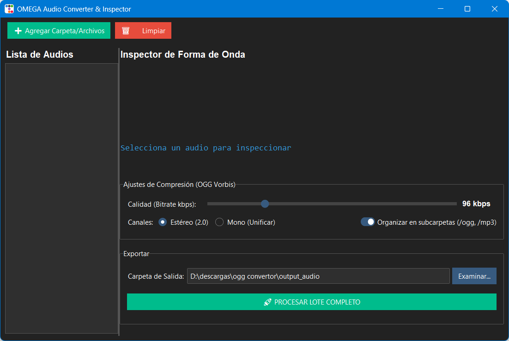

# THIS PROJECT IS ON BETA YET - Be careful

🎧 OMEGA Audio Converter (Unified Suite)

> **Una suite profesional de escritorio para conversión masiva, compresión y visualización de ondas de audio, optimizada para OGG Vorbis (Videojuegos y Web).**

**OMEGA Audio Converter** es la evolución definitiva del antiguo _Audio Toolkit_. Fusiona 4 herramientas independientes en una sola interfaz gráfica moderna. Diseñada para desarrolladores y creadores de contenido, esta herramienta te permite visualizar cómo se comporta el audio, predecir su peso final y convertir bibliotecas enteras a formatos ligeros en segundos.



## ✨ Características Estrella

- **🌊 Visor de Onda Reactivo (Waveform):** Inspecciona visualmente los picos y silencios de cada pista de audio. El dibujo se genera en segundo plano (Multihilo) para garantizar que la interfaz jamás se congele, incluso con audios de 1 hora.
- **🧠 Calculador Predictivo en Tiempo Real:** Mientras ajustas el control deslizante de calidad (Bitrate), el sistema recalcula instantáneamente el peso estimado del archivo final y te muestra el porcentaje exacto de ahorro de disco.
- **⚡ Conversor Universal:** Arrastra archivos MP3, WAV, FLAC, M4A o AAC y unifícalos al estándar libre de regalías **OGG Vorbis**.
- **🗂️ Auto-Organizador:** Activa la opción "Organizar en subcarpetas" y el script creará automáticamente las carpetas `/ogg` para que tus recursos no se mezclen con los originales.
- **🔉 Control de Canales:** ¿Tu audio web no necesita sonido envolvente? Fuerza la conversión de Estéreo a Mono con un clic para reducir el peso a la mitad sin tocar el bitrate.

---

## ⚙️ Requisitos e Instalación

El script cuenta con un **Auto-Instalador** para sus dependencias de Python (Pydub, Pillow, TTKBootstrap). Sin embargo, requiere un motor de audio externo.

**Requisito Obligatorio:**

- **FFmpeg:** Debe estar instalado y agregado a las Variables de Entorno (PATH) de tu sistema. Si no lo tienes, revisa la [Guía de Instalación de FFmpeg](INSTALL_FFMPEG.md).

### Ejecución

```bash
python omega_audio_converter.py
```

📖 Guía de Uso

Cargar Audios: Usa el botón ➕ Agregar para cargar tus efectos de sonido o pistas musicales.

Inspeccionar: Haz clic sobre cualquier elemento de la lista. Verás su forma de onda en el Inspector y sus datos originales (peso, duración, bitrate).

Calibrar Calidad:

Ajusta el slider de "Calidad (Bitrate)".

Para Web/FX: 96 kbps a 128 kbps es el estándar dorado (buen sonido, bajo peso).

Para Música de Alta Fidelidad: 192 kbps a 320 kbps.
Procesar: Elige tu carpeta de salida y presiona 🚀 PROCESAR LOTE COMPLETO.
📈 Evolución del Proyecto (Changelog)

Esta suite reemplaza y unifica los siguientes scripts antiguos de terminal (CLI):

🗑️ converter-ogg.py (Ahora integrado como motor base).

🗑️ separate-ogg-files.py (Ahora integrado como el "Auto-Organizador").

🗑️ ogg-compressor.py y ogg-compressor-max.py (Reemplazados por el Calculador Predictivo Dinámico).
Beneficio: Ya no tienes que adivinar qué bitrate usar para que el audio pese menos de 1MB; el software hace el cálculo por ti visualmente antes de exportar.

⚖️ Licencia y Créditos

Este proyecto utiliza librerías de código abierto de Python y el potente motor de procesamiento multimedia FFmpeg.

Desarrollado para optimización masiva de assets en motores como Godot, Unity, Unreal Engine y Desarrollo Web.

```

```
